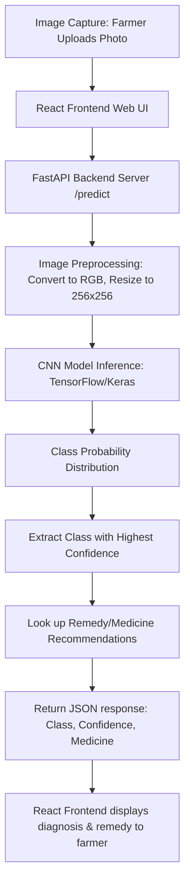

# Arecanut Disease Detection: Technical Project Report

This repository contains the **Arecanut Disease Detection** project, which leverages Deep Learning (Convolutional Neural Networks) to automate the identification of various arecanut (betel nut) plant diseases and recommend targeted treatments to farmers.

---

## 1. Project Overview & Architecture

Arecanut is a vital tropical cash crop in India. However, arecanut plants are highly susceptible to diseases affecting their foliage, trunk, and nuts. Early detection is critical to preventing crop failure and economic losses. 

This project implements a complete end-to-end classification system:
* **Deep Learning Engine:** A custom-trained Convolutional Neural Network (CNN) built in TensorFlow and Keras.
* **Inference API Backend:** A FastAPI web server (`api/main.py`) that loads the serialized model and handles image classification requests, returning predicted class labels, confidence scores, and remediation advice.
* **Frontend Interface:** A React-based web application enabling users to upload images and immediately view diagnostic reports.

### System Flowchart

---

## 2. Data Definition

The system's dataset was collected using digital cameras from farms located in the **Shimoga District, Karnataka, India**.

### Dataset Specifications
* **Format:** Raw RGB images of leaves, trunks, and nuts representing both healthy tissues and various stages of different diseases.
* **Standardized Resolution:** All input images are resized to $256 \times 256$ pixels.
* **Color Channels:** 3 channels (Red, Green, Blue).
* **Dataset Size:** 8,847 total image files.
* **Data Splits:**
  - **Training Set (80%):** ~7,072 images (221 batches of size 32)
  - **Validation Set (10%):** ~864 images (27 batches of size 32)
  - **Test Set (10%):** ~864 images (27 batches of size 32)

### Preprocessing & Data Augmentation
To ensure high classification generalization and prevent model overfitting, a preprocessing pipeline was implemented:
1. **Rescaling:** Pixel values are scaled from the range $[0, 255]$ to $[0, 1]$ by multiplying by `1.0/255`.
2. **Augmentation Layers:**
   - **Random Flips:** Applied both horizontally and vertically.
   - **Random Rotations:** Applied up to a maximum rotation factor of `0.2` (approx. $72^\circ$).

### Class Directory Structure
The dataset is structured into 9 distinct classes mapping to healthy structures and specific crop diseases:

| # | Class Folder Name | Target Subject | Condition / Disease Description |
|---|---|---|---|
| 1 | `Healthy_Leaf` | Leaves | Healthy arecanut foliage. |
| 2 | `Healthy_Nut` | Fruits / Nuts | Healthy betel nuts. |
| 3 | `Healthy_Trunk` | Trunk | Healthy, sturdy tree trunk. |
| 4 | `Mahali_Koleroga` | Fruits / Nuts | **Mahali (Koleroga / Fruit Rot):** Causes rotting and shedding of nuts. |
| 5 | `Stem_bleeding` | Trunk | **Stem Bleeding:** Dark liquid exudate/excreta bleeding from trunk cracks. |
| 6 | `bud_borer` | Buds / Shoots | **Bud Borer Insect Pest:** Larvae boring into buds leading to crown rot. |
| 7 | `healthy_foot` | Trunk Base | Healthy base and root-collar zone of the tree. |
| 8 | `stem cracking` | Trunk | **Stem Cracking:** Longitudinal cracks along the trunk due to moisture stress. |
| 9 | `yellow leaf disease` | Leaves | **Yellow Leaf Disease (YLD):** Foliage turns bright yellow, reducing yield. |

---

## 3. Problem Features

The core machine learning challenge is to extract discriminative spatial patterns (textures, spots, colorations, and fissure geometry) from input crop photographs. 

### CNN Model Architecture
The custom architecture is a sequential convolutional network containing **6 convolutional layers** to automatically perform hierarchic feature extraction:

1. **Input Layer:** Shape `(32, 256, 256, 3)` (Batch size, Height, Width, Channels).
2. **Preprocessing Pipeline:** Rescaling block mapping pixels to $[0, 1]$.
3. **Convolutional Block 1:** Conv2D (32 filters, $3 \times 3$ kernel, ReLU) $\rightarrow$ MaxPooling2D ($2 \times 2$). Output: `(32, 127, 127, 32)`.
4. **Convolutional Block 2:** Conv2D (64 filters, $3 \times 3$ kernel, ReLU) $\rightarrow$ MaxPooling2D ($2 \times 2$). Output: `(32, 125, 125, 64)`. Note: Resized using valid convolution logic.
5. **Convolutional Block 3:** Conv2D (64 filters, $3 \times 3$ kernel, ReLU) $\rightarrow$ MaxPooling2D ($2 \times 2$). Output: `(32, 30, 30, 64)`.
6. **Convolutional Block 4:** Conv2D (64 filters, $3 \times 3$ kernel, ReLU) $\rightarrow$ MaxPooling2D ($2 \times 2$). Output: `(32, 14, 14, 64)`.
7. **Convolutional Block 5:** Conv2D (64 filters, $3 \times 3$ kernel, ReLU) $\rightarrow$ MaxPooling2D ($2 \times 2$). Output: `(32, 6, 6, 64)`.
8. **Convolutional Block 6:** Conv2D (64 filters, $3 \times 3$ kernel, ReLU) $\rightarrow$ MaxPooling2D ($2 \times 2$). Output: `(32, 2, 2, 64)`.
9. **Flatten Layer:** Converts the $2 \times 2 \times 64$ tensor into a 1D vector of **256** elements.
10. **Dense Layer:** 64 neurons (ReLU activation).
11. **Output Layer:** 9 neurons (Softmax activation representing class probability distribution).

### Trainable Parameter Count
* **Total Parameters:** 184,137
* **Trainable Parameters:** 184,137
* **Non-trainable Parameters:** 0

### Optimization Hyperparameters
* **Loss Function:** Sparse Categorical Cross-Entropy.
* **Optimizer:** Adam.
* **Performance Metric:** Accuracy.
* **Epochs:** 50.

---

## 4. Evaluation Experimentation

### Experimental Timeline
There are two experimental phases documented in the repository:
1. **Initial Baseline Proposal:** (Reflected in early documentation like `README.md` and `sudocode.py` draft runs)
   - Dataset size: 620 images.
   - Classification Classes: 3 classes (e.g. `Healthy_Nut`, `Mahali_Koleroga`, `Stem_bleeding`).
   - Split Ratio: 80:20 (Train / Test).
   - Baseline Accuracy achieved: **88.46%** after short-run training.
2. **Expanded Final Setup:** (Executed and verified in `training.ipynb`)
   - Dataset size: 8,847 images.
   - Classification Classes: 9 classes.
   - Split Ratio: 80% Train, 10% Validation, 10% Test.
   - Data augmentation enabled (Flips + Rotations).
   - Duration: 50 Epochs.

### Training Performance Progression (50 Epochs)
Selected training steps show a rapid, stable improvement in metric curves:
* **Epoch 1:**
  - Training Loss: `1.1944` | Training Accuracy: `54.15%`
  - Validation Loss: `0.8897` | Validation Accuracy: `67.36%`
* **Epoch 5:**
  - Training Loss: `0.3643` | Training Accuracy: `87.24%`
  - Validation Loss: `0.2387` | Validation Accuracy: `92.36%`
* **Epoch 15:**
  - Training Loss: `0.0745` | Training Accuracy: `97.29%`
  - Validation Loss: `0.0804` | Validation Accuracy: `98.15%`
* **Epoch 25:**
  - Training Loss: `0.0715` | Training Accuracy: `97.68%`
  - Validation Loss: `0.0526` | Validation Accuracy: `98.38%`
* **Epoch 37:**
  - Training Loss: `0.0119` | Training Accuracy: `99.59%`
  - Validation Loss: `0.0183` | Validation Accuracy: `99.65%`
* **Epoch 50:**
  - Training Loss: `0.000016` | Training Accuracy: `100.00%`
  - Validation Loss: `0.0122` | Validation Accuracy: `99.65%`

---

## 5. Final Evaluation Score

The final, fully-trained model was evaluated on a dedicated, unseen test partition of the dataset (comprising 27 batches of size 32 = 864 images).

### Test Set Metrics
* **Final Test Accuracy:** **99.65%** (Exactly `0.9965277910232544` in Tensorflow evaluation output)
* **Final Test Loss:** **0.0129** (Exactly `0.012886153534054756` in Tensorflow evaluation output)

This extremely high test accuracy confirms that the 6-layer CNN architecture, combined with randomized data augmentation, effectively avoids overfitting while maintaining high feature retrieval capacity.

---

## 6. Treatment Lookup (Remediation Actions)

The API matches the predicted disease class to a treatment profile, returning actionable feedback to the crop manager:

| Predicted Class | Crop Status | Recommended Treatment / Medicine Info |
|---|---|---|
| `Healthy_Leaf` | Healthy | No treatment needed. Maintain healthy practices. |
| `Healthy_Nut` | Healthy | No treatment needed. Maintain healthy practices. |
| `Healthy_Trunk` | Healthy | No treatment needed. Maintain healthy practices. |
| `healthy_foot` | Healthy | No treatment needed. Maintain healthy practices. |
| `Mahali_Koleroga` | Diseased | Spray Bordeaux mixture (1%) or Copper Oxychloride (3 g/L). |
| `Stem_bleeding` | Diseased | Apply Tridemorph (0.1%) or Copper Oxychloride (5 g/L). |
| `bud_borer` | Infested | Spray Chlorpyrifos (0.05%) or Neem Oil (5 ml/L). |
| `stem cracking` | Diseased | Apply Copper Oxychloride (0.3%) and avoid waterlogging. |
| `yellow leaf disease` | Diseased | Spray Fosetyl-Al (0.2%) or Potassium Phosphonate (0.3%). |

---

## 7. Key Project Outcomes & Accuracy Summary

The development and execution of this project yielded several critical outcomes and validation benchmarks:

### 1. High-Accuracy Classification Performance
* **Final Test Accuracy:** **99.65%** (verified on the 864-image test set).
* **Final Test Loss:** **0.0129**.
* **Improvement from Baseline:** The baseline proposal reported **88.46%** accuracy with a 620-image subset. The final system achieved **99.65%** (+11.19% gain) while scaling the target dataset to 8,847 images and expanding the scope to 9 diverse leaf, nut, and trunk classes.

### 2. Large-scale Crop Disease Dataset
* Built a standardized agricultural dataset consisting of **8,847 crop images** collected from plantations in the Shimoga District, Karnataka.
* Grouped the images into 9 labels, isolating 6 common plant diseases/pests and 3 healthy control categories.

### 3. Integrated Software Stack Delivery
* **Trained Model Artifact:** Saved and versioned the model for deployment in standard Keras format (`models/1`).
* **Inference Endpoint:** Implemented a FastAPI backend API with request parsing, real-time batch expansion, classification, and remedy retrieval.
* **Interactive Frontend:** Provided a React single-page dashboard for image drop-zone uploads and instant classification reporting.
